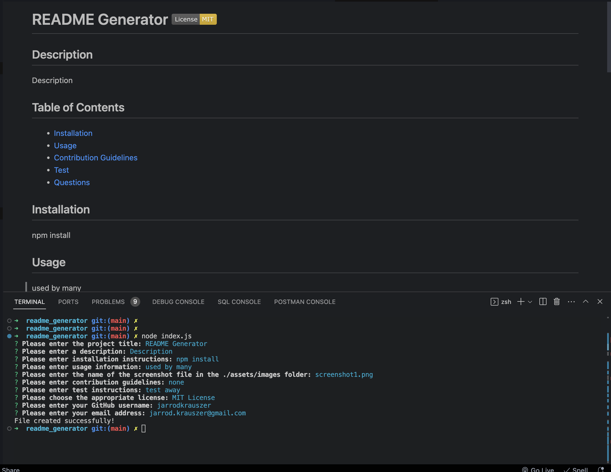

# README Generator     
  
  ## Description
  
  this app does something

  ## Table of Contents

  - [Installation](#installation)
  - [Usage](#usage)
  - [Contribution Guidelines](#contributing)
  - [Test](#tests)
  - [Questions](#questions)

  ## Installation

  install inquirer

  ## Usage

  

  ## License
  
  This app is covered by the [MIT License](https://opensource.org/licenses/MIT)

  ## Contributing

  none
 
  
  ## Tests

  test away

  ## Questions

  Link to my github profile: [jarrodkrauszer](https://github.com/jarrodkrauszer)

  Here is a link to the project: [README_Generator](https://github.com/jarrodkrauszer/readme_generator)
  
  If you have any further questions you can email me at: [jarrod.krauszer@gmail.com](jarrod.krauszer@gmail.com)
